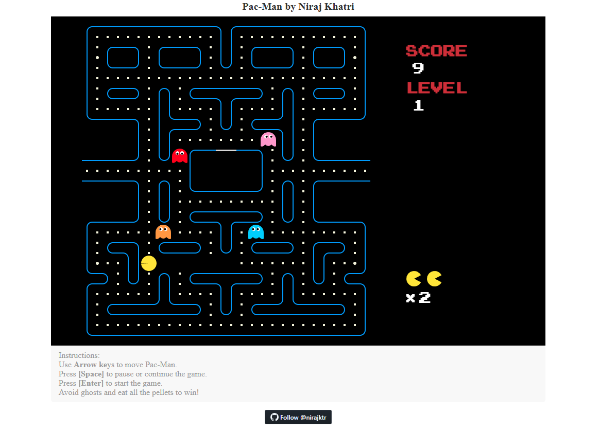

# Pac-Man

Pac-Man is an HTML5 remake of the classic Pac-Man arcade game. It features multiple levels, improved ghost pathfinding, and smooth character animations, making it a great example for learning Canvas-based game development.

## Table of Contents
- [Features](#features)
- [Prerequisites](#prerequisites)
- [Installation](#installation)
- [Usage](#usage)
- [Sample](#sample)
- [Technologies](#technologies)
- [Contributing](#contributing)
- [License](#license)

## Features
- Classic Pac-Man gameplay
- Multiple levels
- Intelligent ghost AI and pathfinding
- Responsive keyboard controls
- Pause and resume functionality

## Prerequisites
- Modern web browser (Chrome, Firefox, Edge, Safari, etc.)
- No additional dependencies required

## Installation

1. Clone the repository:
   ```bash
   git clone https://github.com/nirajktr/pac-man
   ```

2. Navigate to the project directory:
   ```bash
   cd pac-man
   ```

## Usage

1. Open the `index.html` file in your preferred web browser.

2. Play the game using your keyboard:
   - Use **Arrow keys** to move Pac-Man.
   - Press **[Space]** to pause or continue the game.
   - Press **[Enter]** to start the game.
   - Avoid ghosts and eat all the pellets to win!

## Sample



## Technologies
- HTML5
- JavaScript (ES6)
- Canvas API
- CSS

## Contributing

Contributions are welcome! Please follow these steps to contribute:

1. Fork the repository
2. Create a new branch: `git checkout -b feature-name`
3. Make your changes and commit them: `git commit -m "Add feature"`
4. Push to the branch: `git push origin feature-name`
5. Open a pull request on GitHub

## License

[MIT](https://choosealicense.com/licenses/mit/)